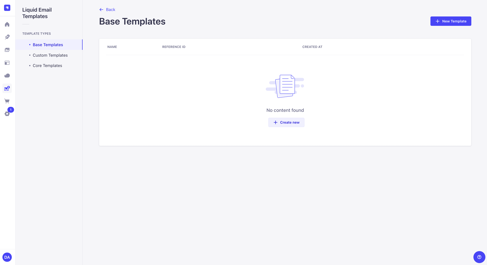
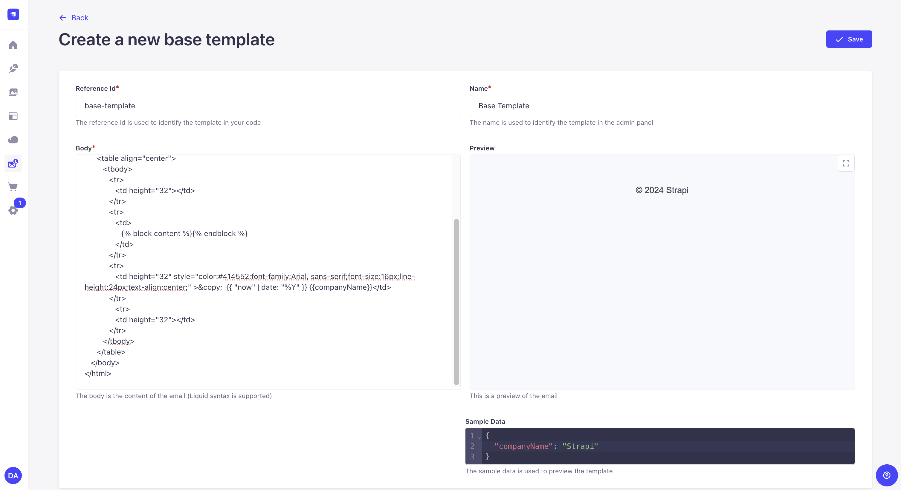
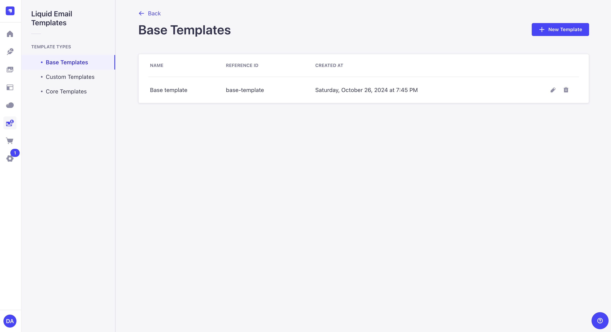
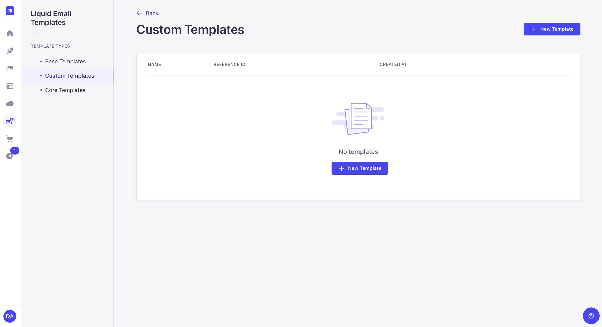
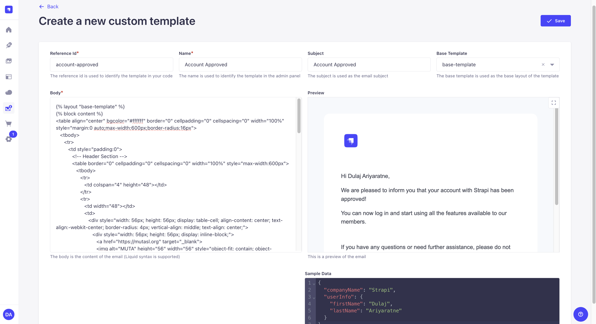
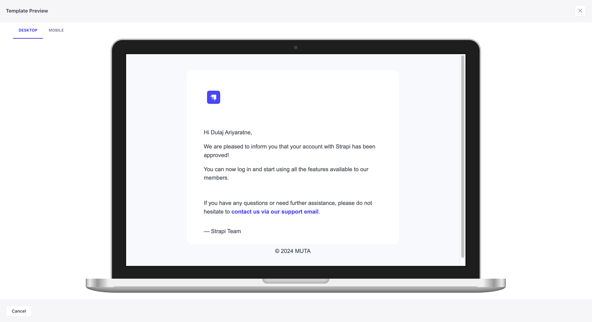
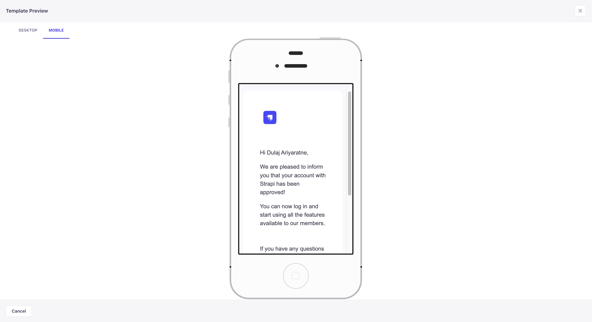
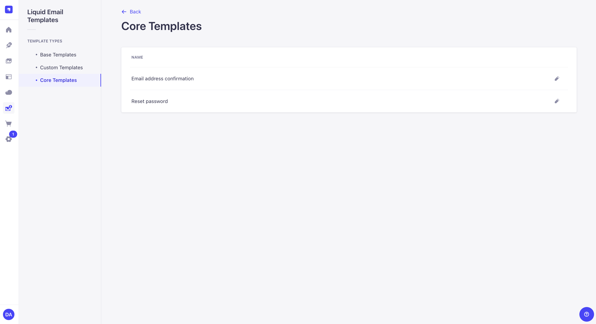
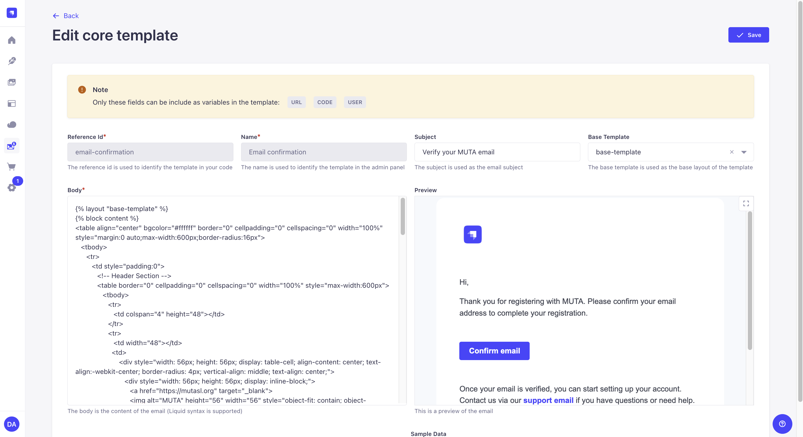

# Strapi Liquid Templates Plugin

The Strapi Liquid Templates Plugin is a custom plugin for Strapi which allows to design and manage your [liquidjs](https://liquidjs.com/index.html) email templates.

## Installation

To install the The Strapi Liquid Templates Plugin, simply run one of the following command:

```
npm install strapi-liquid-templates
```

```
yarn add strapi-liquid-templates
```

## Usage

### Template Types

| Type            | Description                                                                                                                   |
| --------------- | ----------------------------------------------------------------------------------------------------------------------------- |
| Base Template   | Layout templates which can be used with your custom templates or core templates                                               |
| Custom Template | Email templates which can be used with emails                                                                                 |
| Core Template   | Predefined email templates by [users permissions](https://docs.strapi.io/dev-docs/plugins/users-permissions) plugin of strapi |

### 1. Base Templates

Base Templates are the layout templates which can be used with your custom templates or core templates.

### How to Create a Base Template

After installation, click on `Liquid Email Templates` at the dashboard sidebar menu.



Click on `New Template` button, and fill the required details for your base template.



Press on `Save` to save your base template.



### 2. Custom Templates

### How to Create a Custom Template

Click on `Custom Templates` from the Template Types.



Click on `New Template` button, and fill the required details for your custom template. You can use your base template as the layout by selecting it from the dropdown menu.



You can preview your template in desktop and mobile views by clicking on the Expand icon in the Preview section.

Desktop


Mobile


Once you're done with it, press on `Save` to save your custom template.

### 3. Core Templates

There are two core templates available for customization.

1. Email address confirmation
2. Reset password

### How to Edit a Core Template

Click on `Core Templates` from the Template Types.



Click the template you want to edit, and fill the required details for your core template. You can use your base template as the layout by selecting it from the dropdown menu.



Once you're done with it, press on `Save` to save your core template.

### How to Test

Request a password reset for a user which was created under User collection type.

## License

This plugin is licensed under the MIT License. See the LICENSE file for more information.
